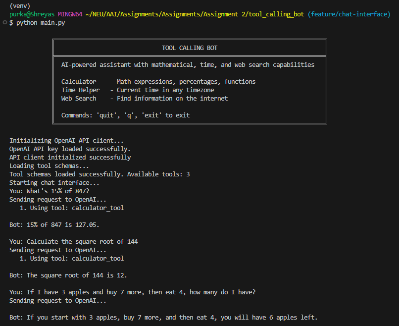
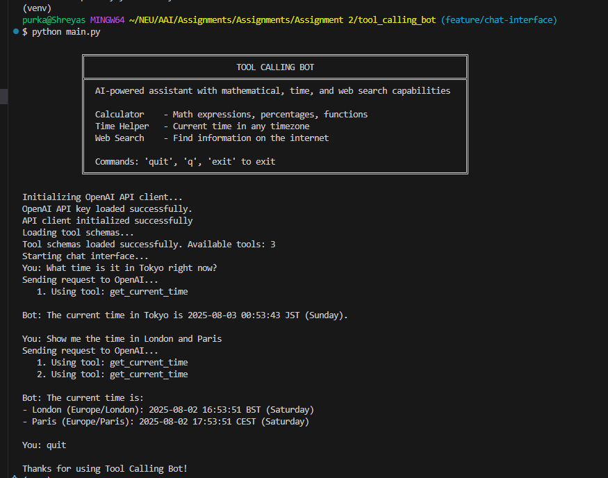
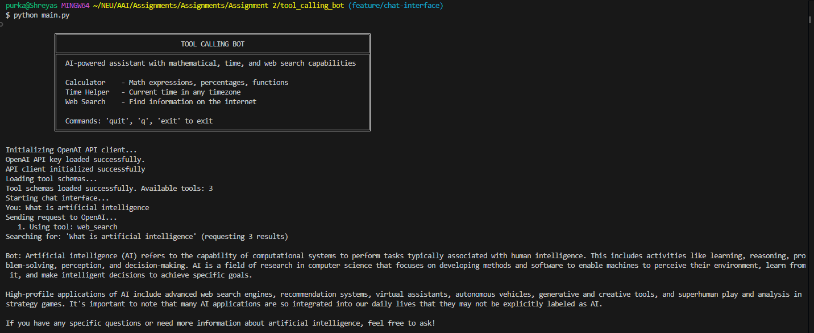
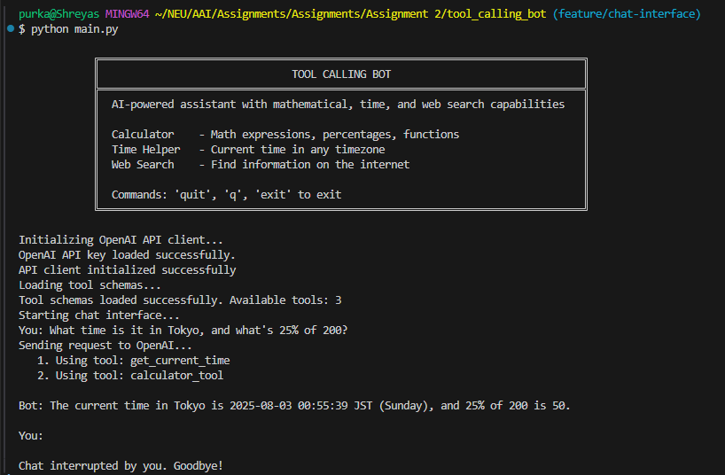
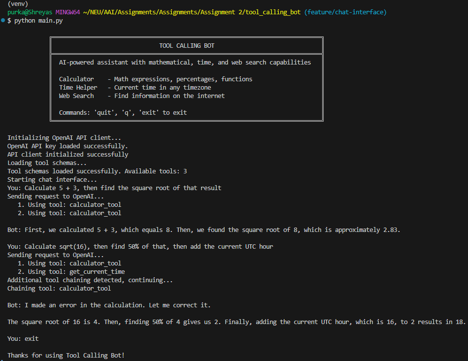

# Tool Calling Bot

A chatbot that can use externally defined tools through API calls to solve problems it can't answer alone. This bot demonstrates the core concept of AI agents - systems that can reason about when and how to use appropriate tools to accomplish tasks.

## Features
- Calculator Tool: Safely evaluate mathematical expressions including functions like sqrt, sin, cos, etc.
- Time Tool: Get current time in any timezone worldwide
- Web Search Tool: Search the web using DuckDuckGo's API

## Quick Start
1. Clone and Install
    ```bash
    git clone <your-repo-url>
    cd tool_calling_bot
    ```

2. Get OpenAI API Keys
    - Visit: https://platform.openai.com/api-keys
    - Create an API key

3. Create .env
    - Set environment variable: OPENAI_API_KEY='your-key-here'    

4. Create virtual environment for the project
    ```bash
    python -m venv venv
    ```

5. Activate virtual environment for the project
    ```bash
    source venv/Scripts/activate
    ```

6. Install Dependencies
    - openai>=1.0.0
    - requests>=2.25.0
    - python-dateutil>=2.8.0
    - pytz>=2021.1
    - sympy>=1.9 
    - python-dotenv>=0.19.0 
    ```bash
    pip install -r requirements.txt
    ```

7. Run the Bot
    ```bash
    python main.py
    ```
## Example Conversations
### 1. Calculator Query


### 2. Time Query


### 3. Web Search Query


### 4. Multi-Tool Query  


### 5. Tool Chaining Query


## Known Limitations
- Web Search: Limited to DuckDuckGo API results, may not have real-time information for all queries
- Calculator: Only supports safe mathematical operations, no file system access
- Timezone: Requires exact timezone names
- Rate Limits: Subject to API provider rate limits